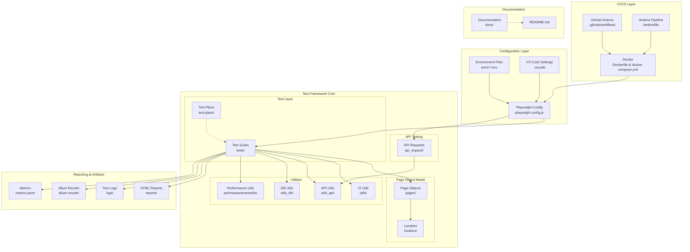

# PlaywrightProwess 🎭

[](https://playwright.dev/)
[](https://developer.mozilla.org/en-US/docs/Web/JavaScript)
[](https://www.docker.com/)
[](https://www.jenkins.io/)

## 📋 Table of Contents

- [Overview](#overview)
- [Architecture](#architecture)
- [Key Features](#key-features)
- [Project Structure](#project-structure)
- [Prerequisites](#prerequisites)
- [Installation & Setup](#installation--setup)
- [Configuration](#configuration)
- [Running Tests](#running-tests)
- [Reporting](#reporting)
- [CI/CD Integration](#cicd-integration)
- [Best Practices](#best-practices)
- [Contributing](#contributing)
- [License](#license)
- [Contact](#contact)

## 🎯 Overview

**PlaywrightProwess** is a comprehensive, enterprise-grade automation framework built on Microsoft Playwright. It provides a robust solution for end-to-end testing of web applications with support for parallel execution, cross-browser testing, API validation, and seamless CI/CD integration.

### Why PlaywrightProwess?

- **Scalable Architecture**: Built with Page Object Model for maintainability
- **Multi-Environment Support**: Easy configuration switching between dev, qa, staging, and production
- **Parallel Execution**: Run tests concurrently to reduce execution time
- **Cross-Browser Testing**: Test on Chromium, Firefox, and WebKit
- **API & UI Testing**: Unified framework for both API and UI test automation
- **Rich Reporting**: Allure and HTML reports with detailed test execution data
- **CI/CD Ready**: Pre-configured Docker and Jenkins pipelines

## 🏗️ Architecture



### Architecture Layers

#### 1. **CI/CD Layer**
- **GitHub Actions**: Automated workflows for continuous integration
- **Jenkins**: Pipeline configuration for enterprise CI/CD
- **Docker**: Containerization for consistent test execution environments

#### 2. **Configuration Layer**
- **Playwright Config**: Central configuration for browser settings, timeouts, and reporters
- **Environment Files**: Separate configurations for different environments (dev, qa, staging, prod)
- **VS Code Settings**: IDE-specific configurations for development

#### 3. **Test Framework Core**
- **Test Layer**: Actual test scripts organized by features/modules
- **Page Object Model**: Encapsulates UI elements and actions for better maintainability
- **Locators**: Centralized element locators for easy updates
- **Utilities**: Reusable helper functions for UI, API, DB operations, and performance testing
- **API Testing**: Dedicated layer for API validation

#### 4. **Reporting & Artifacts**
- **HTML Reports**: Built-in Playwright HTML reports
- **Allure Reports**: Rich, interactive test reports
- **Logs**: Detailed execution logs for debugging
- **Metrics**: Performance metrics in Prometheus format

## ✨ Key Features

### 🚀 **Performance & Execution**
- **Parallel Test Execution**: Run tests across multiple workers for 5-10x faster execution
- **Test Sharding**: Distribute tests across multiple machines
- **Smart Retry Mechanism**: Automatically retry flaky tests
- **Test Isolation**: Each test runs in a fresh browser context

### 🌐 **Cross-Browser Support**
- Chromium (Chrome, Edge)
- Firefox
- WebKit (Safari)
- Mobile browser emulation

### 🔧 **Environment Management**
- Dynamic environment loading via `.env` files
- Support for multiple environments (dev, qa, staging, production)
- Environment-specific test data management

### 📊 **Reporting & Analytics**
- **Allure Reports**: Rich, interactive reports with charts and graphs
- **HTML Reports**: Built-in Playwright HTML reports with screenshots and videos
- **Trace Viewer**: Detailed execution traces for debugging
- **Performance Metrics**: Capture and report performance data

### 🔐 **API Testing**
- RESTful API testing support
- Request/Response validation
- Authentication handling
- API performance measurement

### 🗄️ **Database Testing**
- Database connectivity utilities
- Data validation against database
- Test data setup and teardown

### 📝 **Test Organization**
- Page Object Model (POM) pattern
- Centralized locator management
- Reusable utility functions
- Tag-based test execution (@smoke, @regression, @api, etc.)

### 🔄 **CI/CD Integration**
- Pre-configured Jenkins pipeline
- Docker support for containerized execution
- GitHub Actions workflow
- Easy integration with other CI/CD tools

## 📁 Project Structure

```
PlaywrightProwess/
│
├── .github/                    # GitHub Actions workflows
│   └── workflows/
│       └── playwright.yml      # CI workflow configuration
│
├── .vscode/                    # VS Code settings
│   └── settings.json           # IDE configuration
│
├── api_request/                # API test requests
│   ├── auth/                   # Authentication endpoints
│   ├── users/                  # User management endpoints
│   └── products/               # Product endpoints
│
├── docs/                       # Documentation
│   ├── setup-guide.md          # Setup instructions
│   ├── test-writing-guide.md  # Test writing guidelines
│   └── architecture.md         # Architecture details
│
├── env1/                       # Environment configurations
│   ├── .env.dev                # Development environment
│   ├── .env.qa                 # QA environment
│   ├── .env.staging            # Staging environment
│   └── .env.prod               # Production environment
│
├── locators/                   # Centralized locators
│   ├── login-locators.js       # Login page locators
│   ├── dashboard-locators.js  # Dashboard locators
│   └── common-locators.js      # Common UI element locators
│
├── logs/                       # Test execution logs
│   └── test-execution.log      # Generated logs
│
├── pages/                      # Page Object Model
│   ├── BasePage.js             # Base page class
│   ├── LoginPage.js            # Login page object
│   ├── DashboardPage.js        # Dashboard page object
│   └── ProductPage.js          # Product page object
│
├── perfmeasurementutils/       # Performance testing utilities
│   ├── metrics-collector.js    # Metrics collection
│   └── performance-analyzer.js # Performance analysis
│
├── reports/                    # HTML test reports
│   └── index.html              # Generated HTML report
│
├── test-plans/                 # Test plans and documentation
│   ├── smoke-test-plan.md      # Smoke test scenarios
│   └── regression-test-plan.md # Regression test scenarios
│
├── tests/                      # Test scripts
│   ├── ui/                     # UI tests
│   │   ├── login.spec.js       # Login tests
│   │   └── dashboard.spec.js   # Dashboard tests
│   ├── api/                    # API tests
│   │   ├── auth-api.spec.js    # Authentication API tests
│   │   └── user-api.spec.js    # User API tests
│   └── e2e/                    # End-to-end tests
│       └── checkout-flow.spec.js
│
├── utils/                      # UI utility functions
│   ├── browser-utils.js        # Browser helpers
│   ├── data-generator.js       # Test data generation
│   └── screenshot-utils.js     # Screenshot helpers
│
├── utils_api/                  # API utility functions
│   ├── api-client.js           # HTTP client wrapper
│   ├── auth-helper.js          # Authentication helpers
│   └── response-validator.js   # Response validation
│
├── utils_db/                   # Database utility functions
│   ├── db-connector.js         # Database connection
│   ├── query-executor.js       # Query execution
│   └── data-seeder.js          # Test data seeding
│
├── .gitignore                  # Git ignore rules
├── Dockerfile                  # Docker configuration
├── docker-compose.yml          # Docker Compose configuration
├── Jenkinsfile                 # Jenkins pipeline script
├── metrics.prom                # Prometheus metrics
├── package.json                # NPM dependencies
├── package-lock.json           # NPM lock file
├── playwright.config.js        # Playwright configuration
└── README.md                   # This file
```

## 📋 Prerequisites

Before you begin, ensure you have the following installed:

| Tool | Version | Purpose |
|------|---------|---------|
| **Node.js** | 16.x or higher | JavaScript runtime |
| **npm** | 7.x or higher | Package manager |
| **Git** | 2.x or higher | Version control |
| **Docker** | 20.x or higher (optional) | Containerization |
| **Jenkins** | 2.x or higher (optional) | CI/CD automation |

### Verify Installation

```bash
# Check Node.js version
node --version

# Check npm version
npm --version

# Check Git version
git --version

# Check Docker version (if using)
docker --version
```

## 🚀 Installation & Setup

### Step 1: Clone the Repository

```bash
git clone https://github.com/rbarikot/PlaywrightProwess.git
cd PlaywrightProwess
```

### Step 2: Install Dependencies

```bash
# Install all project dependencies
npm install

# Install Playwright browsers
npx playwright install

# Install Playwright browsers with system dependencies (Linux)
npx playwright install --with-deps
```

### Step 3: Verify Installation

```bash
# Run a sample test to verify setup
npx playwright test --list

# Run Playwright in debug mode
npx playwright test --ui
```

## ⚙️ Configuration

### Environment Configuration

The framework supports multiple environments. Set the `ENVIRONMENT` variable to switch between environments:

#### Windows (Command Prompt)
```cmd
set ENVIRONMENT=qa
```

#### Windows (PowerShell)
```powershell
$env:ENVIRONMENT="qa"
```

#### Linux/macOS
```bash
export ENVIRONMENT=qa
```

### Environment Files

Create environment-specific `.env` files in the `env1/` directory:

**env1/.env.qa**
```env
# Application URLs
BASE_URL=https://qa.yourapp.com
API_BASE_URL=https://api-qa.yourapp.com

# Test Credentials
TEST_USER_EMAIL=testuser@example.com
TEST_USER_PASSWORD=SecurePassword123!

# API Configuration
API_TIMEOUT=30000
API_KEY=your-api-key-here

# Database Configuration
DB_HOST=qa-db.yourapp.com
DB_PORT=5432
DB_NAME=qa_database
DB_USER=qa_user
DB_PASSWORD=qa_password

# Feature Flags
ENABLE_FEATURE_X=true
ENABLE_FEATURE_Y=false

# Performance Testing
PERFORMANCE_THRESHOLD_MS=3000
```

### Playwright Configuration

Customize `playwright.config.js` for your needs:

```javascript
// Example configuration sections
module.exports = {
  // Test directory
  testDir: './tests',
  
  // Timeout settings
  timeout: 60000,
  expect: {
    timeout: 10000
  },
  
  // Parallel execution
  fullyParallel: true,
  workers: process.env.CI ? 2 : 4,
  
  // Retry failed tests
  retries: process.env.CI ? 2 : 0,
  
  // Reporters
  reporter: [
    ['html', { outputFolder: 'reports' }],
    ['allure-playwright'],
    ['list']
  ],
  
  // Browser configurations
  projects: [
    {
      name: 'chromium',
      use: { ...devices['Desktop Chrome'] },
    },
    {
      name: 'firefox',
      use: { ...devices['Desktop Firefox'] },
    },
    {
      name: 'webkit',
      use: { ...devices['Desktop Safari'] },
    },
  ],
};
```

## 🧪 Running Tests

### Basic Test Execution

```bash
# Run all tests
npx playwright test

# Run tests in headed mode (see browser)
npx playwright test --headed

# Run tests in debug mode
npx playwright test --debug

# Run tests in UI mode (interactive)
npx playwright test --ui
```

### Test Filtering

```bash
# Run specific test file
npx playwright test tests/ui/login.spec.js

# Run tests by tag
npx playwright test --grep "@smoke"
npx playwright test --grep "@regression"
npx playwright test --grep "@api"

# Exclude tests by tag
npx playwright test --grep-invert "@skip"

# Run tests in specific browser
npx playwright test --project=chromium
npx playwright test --project=firefox
npx playwright test --project=webkit
```

### Parallel Execution

```bash
# Run with specific number of workers
npx playwright test --workers=4

# Run in serial mode (one test at a time)
npx playwright test --workers=1

# Run with maximum workers
npx playwright test --workers=100%
```

### Test Sharding

```bash
# Shard 1 of 3
npx playwright test --shard=1/3

# Shard 2 of 3
npx playwright test --shard=2/3

# Shard 3 of 3
npx playwright test --shard=3/3
```

### Environment-Specific Test Execution

```bash
# Run tests against QA environment
set ENVIRONMENT=qa && npx playwright test

# Run tests against Staging environment
set ENVIRONMENT=staging && npx playwright test

# Run tests against Production environment
set ENVIRONMENT=prod && npx playwright test --grep "@smoke"
```

## 📊 Reporting

### HTML Reports

Playwright generates HTML reports automatically after test execution.

```bash
# View the latest HTML report
npx playwright show-report

# Generate report without running tests
npx playwright show-report reports
```

### Allure Reports

Generate rich, interactive Allure reports:

```bash
# Run tests and generate Allure results
npx playwright test

# Serve Allure report (requires Allure CLI)
allure serve allure-results

# Generate Allure report to a directory
allure generate allure-results --clean -o allure-report

# Open generated Allure report
allure open allure-report
```

### Install Allure CLI

```bash
# Using npm
npm install -g allure-commandline

# Using Homebrew (macOS)
brew install allure

# Using Scoop (Windows)
scoop install allure
```

### Trace Viewer

View detailed execution traces for debugging:

```bash
# Open trace viewer for a specific trace file
npx playwright show-trace trace.zip

# Generate trace during test execution
npx playwright test --trace on
```

### Screenshots and Videos

Configure screenshot and video capture in `playwright.config.js`:

```javascript
use: {
  // Capture screenshot on failure
  screenshot: 'only-on-failure',
  
  // Record video on failure
  video: 'retain-on-failure',
  
  // Always record video
  // video: 'on',
  
  // Always capture screenshots
  // screenshot: 'on',
}
```

## 🔄 CI/CD Integration

### GitHub Actions

The repository includes a pre-configured GitHub Actions workflow in `.github/workflows/playwright.yml`:

**Key Features:**
- Automatic execution on push and pull requests
- Matrix strategy for multi-browser testing
- Artifact upload for reports
- Parallel job execution

**Trigger the workflow:**
```bash
# Push changes to trigger CI
git push origin main

# Or create a pull request
```

### Jenkins

Execute tests in Jenkins using the included `Jenkinsfile`:

**Pipeline Stages:**
1. Checkout code
2. Install dependencies
3. Run tests (parallel stages for different browsers)
4. Publish reports
5. Archive artifacts

**Setting up Jenkins:**
1. Create a new Pipeline job
2. Point to your repository
3. Specify `Jenkinsfile` as the pipeline script path
4. Configure webhooks for automatic triggering

**Manual Trigger:**
```bash
# From Jenkins Dashboard
Build Now → Build with Parameters → Select Environment
```

### Docker

Run tests in containerized environments:

```bash
# Build Docker image
docker build -t playwrightprowess:latest .

# Run tests in Docker container
docker run -it playwrightprowess:latest

# Use Docker Compose
docker-compose up --abort-on-container-exit

# Clean up
docker-compose down
```

**docker-compose.yml features:**
- Multi-container setup
- Service dependencies
- Volume mounting for reports
- Network configuration

### Azure DevOps / GitLab CI

The framework can be easily adapted for other CI/CD platforms:

**Azure Pipelines (azure-pipelines.yml):**
```yaml
trigger:
  - main

pool:
  vmImage: 'ubuntu-latest'

steps:
  - task: NodeTool@0
    inputs:
      versionSpec: '16.x'
  
  - script: npm ci
    displayName: 'Install dependencies'
  
  - script: npx playwright install --with-deps
    displayName: 'Install browsers'
  
  - script: npx playwright test
    displayName: 'Run Playwright tests'
  
  - task: PublishTestResults@2
    inputs:
      testResultsFiles: 'reports/**/*.xml'
```

**GitLab CI (.gitlab-ci.yml):**
```yaml
image: mcr.microsoft.com/playwright:latest

stages:
  - test

playwright-tests:
  stage: test
  script:
    - npm ci
    - npx playwright test
  artifacts:
    when: always
    paths:
      - reports/
      - allure-results/
```

## 📚 Best Practices

### Test Writing Guidelines

1. **Use Page Object Model**
   ```javascript
   // Good
   const loginPage = new LoginPage(page);
   await loginPage.login(email, password);
   
   // Avoid
   await page.fill('#email', email);
   await page.fill('#password', password);
   await page.click('button[type="submit"]');
   ```

2. **Use Descriptive Test Names**
   ```javascript
   // Good
   test('should display error message when login with invalid credentials', async ({ page }) => {
     // test code
   });
   
   // Avoid
   test('test1', async ({ page }) => {
     // test code
   });
   ```

3. **Tag Your Tests**
   ```javascript
   test('@smoke @login should successfully login with valid credentials', async ({ page }) => {
     // test code
   });
   ```

4. **Use Assertions Effectively**
   ```javascript
   // Good - specific assertions
   await expect(page.locator('.error-message')).toContainText('Invalid credentials');
   await expect(page.locator('.user-profile')).toBeVisible();
   
   // Avoid - generic assertions
   expect(true).toBe(true);
   ```

5. **Handle Waits Properly**
   ```javascript
   // Good - use built-in waits
   await page.waitForLoadState('networkidle');
   await expect(element).toBeVisible();
   
   // Avoid - hard waits
   await page.waitForTimeout(5000);
   ```

### Performance Optimization

1. **Reuse Browser Contexts**
2. **Use Parallel Execution**
3. **Implement Smart Retries**
4. **Optimize Selectors**
5. **Mock External Dependencies**

### Code Organization

1. **Keep Tests Independent**: Each test should be able to run standalone
2. **Use Fixtures**: Leverage Playwright fixtures for setup/teardown
3. **Centralize Configuration**: Use environment files and config objects
4. **Version Control**: Commit meaningful changes with clear messages
5. **Code Reviews**: Review all test code before merging

## 🤝 Contributing

We welcome contributions! Please follow these guidelines:

### Getting Started

1. Fork the repository
2. Create a feature branch: `git checkout -b feature/amazing-feature`
3. Make your changes
4. Run tests: `npx playwright test`
5. Commit your changes: `git commit -m 'Add amazing feature'`
6. Push to the branch: `git push origin feature/amazing-feature`
7. Open a Pull Request

### Pull Request Guidelines

- Provide a clear description of the changes
- Ensure all tests pass
- Add new tests for new features
- Update documentation as needed
- Follow the existing code style
- Reference any related issues

### Code Style

- Use ESLint configuration
- Follow JavaScript Standard Style
- Write clear, self-documenting code
- Add comments for complex logic

### Reporting Issues

Use GitHub Issues to report bugs or request features:
- Use the issue template
- Provide detailed reproduction steps
- Include screenshots or videos if applicable
- Specify environment details

## 📄 License

This project is licensed under the **MIT License** - see the [LICENSE](LICENSE) file for details.

## 📧 Contact

**Author**: rbarikot

**Email**: [rbarikot@example.com](mailto:rbarikot@example.com)

**GitHub**: [https://github.com/rbarikot](https://github.com/rbarikot)

## 🙏 Acknowledgments

- [Playwright Team](https://playwright.dev/) for the amazing testing framework
- [Allure Report](https://docs.qameta.io/allure/) for beautiful test reports
- The open-source community for continuous inspiration

## 📚 Additional Resources

- [Playwright Documentation](https://playwright.dev/docs/intro)
- [Playwright API Reference](https://playwright.dev/docs/api/class-playwright)
- [Playwright Best Practices](https://playwright.dev/docs/best-practices)
- [Allure Report Documentation](https://docs.qameta.io/allure/)
- [Docker Documentation](https://docs.docker.com/)
- [Jenkins Documentation](https://www.jenkins.io/doc/)

---

**⭐ Star this repository if you find it helpful!**

**🐛 Found a bug? [Report it here](https://github.com/rbarikot/PlaywrightProwess/issues)**

**💡 Have a feature request? [Let us know](https://github.com/rbarikot/PlaywrightProwess/issues)**
