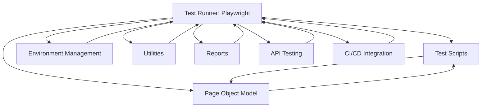

# Automation Architecture Diagram for PlaywrightProwess

## **Overview**
This document outlines the automation architecture for the PlaywrightProwess project, highlighting key components and their interactions.

---

## **Diagram**

---

## **Components**

### **1. Test Runner**
- **Tool**: Playwright
- **Configuration**: `playwright.config.js`
- **Features**:
  - Parallel execution
  - Retries
  - Environment-specific settings

### **2. Test Scripts**
- **Location**: `tests/`
- **Structure**:
  - Organized by functionality (e.g., login, dashboard).
  - Tagged for filtering (`@smoke`, `@regression`).

### **3. Environment Management**
- **Location**: `env1/`
- **Files**: `.env.dev`, `.env.qa`, etc.
- **Purpose**:
  - Manage environment-specific variables (e.g., `BASE_URL`).
  - Dynamically loaded based on the `ENVIRONMENT` variable.

### **4. Utilities**
- **Location**: `utils/`
- **Files**:
  - `ActionsUtil.js`: Common actions (e.g., click, type).
  - `ConfigReader.js`: Reads configuration settings.
  - `Logger.js`: Logs test execution details.
  - `WaitUtil.js`: Handles wait conditions.

### **5. Reports**
- **Location**: `reports/`, `allure-results/`
- **Tools**:
  - Allure reporter
  - HTML reporter

### **6. CI/CD Integration**
- **Files**: `Jenkinsfile`, `docker-compose.yml`
- **Purpose**:
  - Automate test execution in CI/CD pipelines.
  - Distribute tests across multiple agents for parallel execution.

### **7. Page Object Model (POM)**
- **Location**: `pages/`
- **Purpose**:
  - Encapsulate locators and actions for specific pages.

### **8. API Testing**
- **Location**: `utils_api/`, `api_request/`
- **Purpose**:
  - Handle API-related test cases.

---

## **Usage**
- Use the diagram to understand the flow and interaction between components.
- Refer to the components section for detailed information about each part of the architecture.

---

Let me know if you need further modifications or additional details!